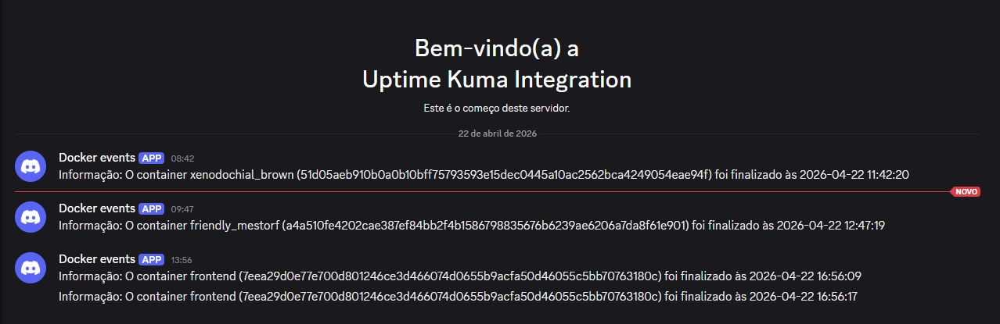

🐳 Docker: Do Básico ao Avançado
Este repositório contém os projetos e laboratórios práticos desenvolvidos durante o treinamento Docker: Do Básico ao Avançado. O objetivo é consolidar conhecimentos desde a fundação de containers até o deploy automatizado e monitoramento.

🚀 Tecnologias e Conceitos Aplicados
Fundamentos: Namespaces, Cgroups e o funcionamento interno do kernel Linux.

Eficiência de Imagens: Multi-stage build, boas práticas de Dockerfile e camadas (OverlayFS).

Orquestração: Docker Compose para ambientes locais e Docker Swarm para alta disponibilidade.

Monitoramento & Automação: Python integrado à API do Docker e CI/CD via GitHub Actions.

Segurança: Rootless containers, permissionamento e gestão de volumes.

📂 Estrutura do Repositório
O projeto está dividido em três frentes principais:

1. Build/ (Node.js App)
Focado no ciclo de vida de uma aplicação Node.js.

Dockerfile Otimizado: Uso de imagens Alpine e boas práticas de segurança (usuário não-root).

Healthcheck: Monitoramento de saúde nativo do Docker.

### 📸 Demonstração do Monitoramento

Build Args: Passagem de variáveis de versão (VERSION) em tempo de build.

2. Compose/ (Ambiente Multi-serviço)
Exemplo de orquestração simplificada utilizando Docker Compose para subir serviços de infraestrutura (como Nginx) de forma rápida e reprodutível.

3. Monitoramento - Python/ (Event Listener)
Um projeto prático de observabilidade:

Docker SDK para Python: O script events.py escuta o socket do Docker (docker.sock).

Integração com Discord: Alertas em tempo real sempre que um container "morre" (die event).

CI/CD (GitHub Actions): Pipeline automatizado que realiza o deploy na VM remota via SSH e SCP sempre que há um push na branch main.

🛠️ Como Executar
Pré-requisitos
Docker instalado

Docker Compose

Subindo a aplicação Node (Build)
Bash
cd Build
docker-compose up -d --build
Acesse em: http://localhost:5055

Rodando o Monitor de Eventos
Adicione sua URL de Webhook do Discord no arquivo events.py.

Execute o container mapeando o socket:

Bash
cd "Monitoramento - Python"
docker build -t monitor-docker .
docker run -d -v /var/run/docker.sock:/var/run/docker.sock monitor-docker
⚙️ CI/CD Pipeline
A automação configurada em .github/workflows/main.yaml segue o fluxo:

Checkout: Pega o código mais recente.

SCP: Transfere os arquivos para o servidor de destino.

SSH Deploy: * Realiza o build da imagem na VM.

Para e remove containers antigos.

Sobe o novo container com acesso ao socket do Docker.

Limpa imagens órfãs para otimização de disco.

✍️ Autor
Pedro Carriel - Desenvolvedor & DevOps Enthusiast

Este projeto faz parte do meu portfólio de especialização em containers e cultura DevOps.